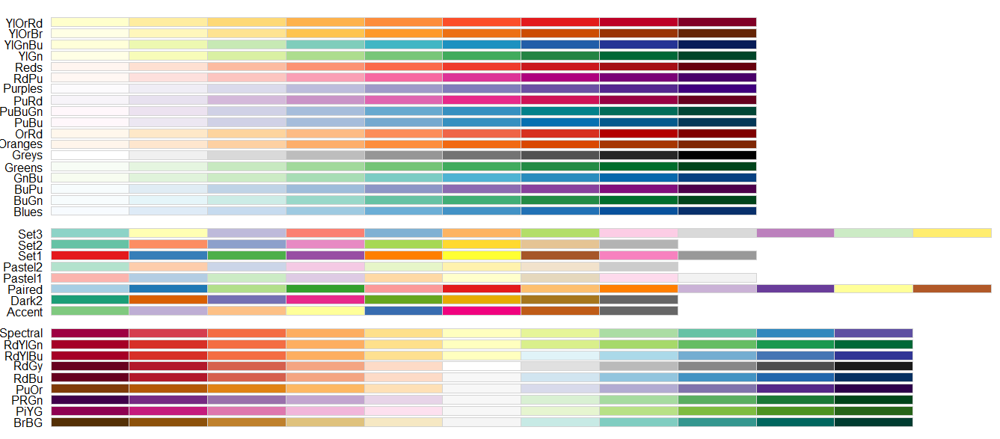

# Visualizaciones de datos en R

```
Al terminar este capítulo ustedes van a poder:
- Entender la sintáxis usada por ggplot
- Hacer gráficos de dispersión de puntos y de líneas 
- Modificar los valores predeterminados de las paletas de colores, etiquetas, títulos, entre otros elementos de los gráficos
- Exportar los gráficos con calidad de publicación
- Animar y exportar animaciones de gráficos
```
## La importancia de la visualización de los datos

La visualización de datos ha ganado espacio en diversas publicaciones y en las últimas décadas ya constituye una disciplina en sí misma. Su relevancia podría justificarse de muchas maneras, pero hay un punto que es especialmente relevante para el análisis de datos: los parámetros y coeficientes con los que solemos trabajar no siempre son tan simples de interpretar como pensamos. Por ejemplo, algunos autores recomiendan fuertemente graficar las predicciones del modelo ante distintos valores, antes que los coeficientes del modelo (McElreath, 2016).

Este punto dista de ser uno moderno. En 1973 el estadístico Francis Anscombe aportó la siguiente evidencia sobre cómo muchas de las variables que solemos tomar como de resumen, o incluso de relación entre ellas, puede engañarnos si no visualizamos correctamente los datos:

```{r echo=FALSE,eval=TRUE}
library(tidyverse)
library(ggthemes)
dfAnscombe<- anscombe %>%
 pivot_longer(everything(),
   names_to = c(".value", "dataset"),
   names_pattern = "(.)(.)"
 )
dfAnscombe <- dfAnscombe %>% mutate(dataset=paste0("Dataset ",dataset))
ggplot(dfAnscombe,aes(x = x,y = y)) +
  geom_point(aes(x,y)) +
  geom_smooth(method='lm',formula=y~x,se = FALSE) +
  facet_wrap(~dataset) +
  theme_fivethirtyeight() + scale_fill_fivethirtyeight()
```

Si prestan atención, van a poder ver que la nube de puntos de cada uno de los datasets es bien distinta. El primero de arriba a la izquierda parece un scatter plot alrededor de una media, que podría modelarse linealmente. El segundo, el de arriba a la derecha, parecería tener una relación más cuadrática. El tercero, el de abajo a la izquierda, muestra una relación linea aparentemente con baja volatilidad, pero un punto bien alejado de esa recta, mientras que el último muestra casi ninguna relación entre x e y, con la excepción de un punto muy alejado del resto.

¿Pero que sucede cuando trazamos una línea que minimiza la distancia cuadrática entre los puntos? La recta (azul) es ¡la misma! ¿Y qué pasa con los promedios de las variables y la correlación entre ellas? También son iguales:

```{r echo=FALSE,eval=TRUE}
dfAnscombe %>%
  group_by(dataset) %>%
  summarise(promedioX = mean(x),
            promedioY = mean(y),
            corXY = cor(x,y))
```

De esta manera queda en claro que, en algunas ocasiones, trabajar con resumenes de nuestros datos puede llevarnos a extraer conclusiones erróneas sobre cómo deberíamos analizarlos.

Durante los años se fue mejorando este punto que hizo Anscombe y... ahora sabemos que una nube de puntos que se parece a un dinosauro: si nos guiamos solo por las clásicas medidas de resumen, son indistinguibles

```{r echo=FALSE}
knitr::include_graphics(path="Figuras/Capitulo 3/DinoSequentialSmaller.gif")
```

## GGPLOT: Grammar of Graphics

Cuando se trata de hacer visualizaciones en R, **ggplot** es, por lejos, nuestro principal aliado y la librería más ampliamente difundida. Este paquete viene incluido dentro de **tidyverse**, por lo que cargando dicho paquete ya van a contar con todas sus funciones.

Con ggplot podemos crear decenas de distintos tipos de gráficos mediante una sintáxis unificada, lo que hace que se ganen importante economías de escala, una vez superada la curva de aprendizaje.

```{r message=FALSE}
library(tidyverse)
```

## ¿Cuál es la relación entre el ingreso de un país y la expectativa de vida al nacer? Scatterplot

Una nube de puntos o scatter plot es un tipo de gráfico que, por lo general, muestra la relación entre dos variables. Digo por lo general, porque en rigor es posible agregar otra información en estos gráficos mediante colores o tamaños de los puntos. Sigamos con el ejemplo del capitulo dos: los datos de **gapminder**. Vamos a filtrar los datos para el año 2007, el último en este dataset.

```{r}
gapminder_df <- read.table(file = "https://raw.githubusercontent.com/martintinch0/CienciaDeDatosParaCuriosos/master/data/gapminder.csv",
                           sep=';',
                           header = TRUE,
                           stringsAsFactors = FALSE)
gapminderLastCut <- gapminder_df %>% filter(year==2007)
```

Ya podemos comenzar con nuestro primer ejemplo. **ggplot** comienza siempre de la misma manera: usando la función homónima y comentando que datos queremos graficar. Luego, le decimos qué tipo de gráfico queremos hacer, lo que en GG se hace con **geom_**, seguido por un sufijo que hace referencia específica al tipo de gráfico. 

Además, GGPLOT no hace magia: en este caso, necesita saber qué variable poner en el eje x y cuál otra poner en el eje y. En ggplot, estas últimas indicaciones van dentro de una función que se llama **aes()**, que es la abreviación de **aesthetics**.

```{r}
ggplot(data = gapminderLastCut,
       mapping = aes(x=gdpPercap, y = lifeExp)) +
  geom_point()
```

Nuestro gráfico scatter, que en ggplot se hace con **geom_point()**, muestra en el eje horizontal el PIB per cápita de los países y en el eje vertical la expectativa de vida al nacer. La grilla de fondo de color gris y los títulos de los ejes son defaults de ggplot, así como la - no tan recomendada - decisión de cortar al eje vertical en un valor levemente superior a 40 años.

Una vez que tenemos los datos que queremos en nuestro gráfico, podemos empezar a cambiar estos detalles que pueden no gustarnos. Para empezar, los títulos de los ejes tienen por definición el nombre de las variables, vamos a ponerles nombres más acordes a lo que estamos mostrando. Como irán aprendiendo, estos cambios van en distintas partes de nuestro código de ggplot mediante nuevas funciones agregadas por medio de **+**:

```{r}
ggplot(data = gapminderLastCut,
       mapping = aes(x=gdpPercap, y = lifeExp)) +
  geom_point() +
  labs(x = "PIB per cápita",
       y = "Expectativa de vida al nacer (en años)")
```

En este caso usamos la función **labs()**, con sus respectivos parámetros x e y, a los que les pasamos directamente el nombre que queremos que tenga. La función labs permite más cosas que esto, como agregar título, subtítulos e incluso información sobre la fuente de nuestro gráfico:

```{r}
ggplot(data = gapminderLastCut,
       mapping = aes(x=gdpPercap, y = lifeExp)) +
  geom_point() +
  labs(x = "PIB per cápita",
       y = "Expectativa de vida al nacer (en años)",
       title="A más ingresos mayor tiempo de vida?",
       subtitle="Expectativa de vida al nacer según nivel de ingreso",
       caption="Fuente: Gapminder")
```

### Agregando colores según otras variables

En nuestro data.frame de **gapminder** contamos con otra variable que sería de interés mostrar: el continente del país que hablamos. Esta variable es de tipo categórica y es muy común agregar esta clase de variables en nuestros gráficos de dispersión o **scatter plots**

Agregar esta clase de información es realmente fácil. Dentro de la función **aes()**, además de determinar cuáles son los valores del eje vertical (y) y del eje horizontal (x), podemos indicar cuál es la variable según la cual queremos que ponga los colores: mediante el argumento *color*

```{r}
ggplot(data = gapminderLastCut,
       mapping = aes(x=gdpPercap, y = lifeExp,color=continent)) +
  geom_point() +
  labs(x = "PIB per cápita",
       y = "Expectativa de vida al nacer (en años)",
       title="A más ingresos mayor tiempo de vida?",
       subtitle="Expectativa de vida al nacer según nivel de ingreso",
       caption="Fuente: Gapminder")
```

Podemos observar cómo los colores no se distribuyen aleatoriamente entre niveles de ingreso, sino que se ubican más o menos en los mismos rangos, con algunas excepciones. Más adelante vamos a ver un gráfico que nos va a ser útil para detectar estás diferencias.

### Creando paneles con facet_wrap()

Los paneles son realmente fáciles de armar en ggplot. Lo unico que debemos decirle es que queremos hacerlos y qué variable usaremos para cortar a nuestros datos y mostrarlos de a partes. Imaginemos que queremos mostrar el mismo gráfico de relación entre PIB per cápita y expectativas de vida al nacer (en años) que hicimos anteriormente, pero para cada uno de los continentes por separados: muy simple.

```{r}
ggplot(data = gapminderLastCut,
       mapping = aes(x=gdpPercap, y = lifeExp)) +
  geom_point() +
  labs(x = "PIB per cápita",
       y = "Expectativa de vida al nacer (en años)",
       title="A más ingresos mayor tiempo de vida?",
       subtitle="Expectativa de vida al nacer según nivel de ingreso",
       caption="Fuente: Gapminder") +
  facet_wrap(~ continent)
```

Fácil, no? Lo único que cambiamos fue que no queremos colorear por continente, sino que queremos que se creen tantos gráficos como continentes hay en nuestros datos. 

## ¿Cuál fue la evolución de la expectativa de vida al nacer? Gráfico de líneas

Otro de los gráficos más simples consiste en analizar la evolución de una determinada variable en el tiempo mediante una línea de tiempo. En **ggplot** estos gráficos pueden crearse usando **geom_line**.

Digamos que queremos observar la evolución de la expectativa de vida al nacer promedio por continente. Usando las herramientas de **tidyverse** podemos generar este promedio de la siguiente manera:

```{r}
promedioContinente <- gapminder_df %>%
                      group_by(continent,year) %>%
                      summarise(promedio=mean(lifeExp))
```

Luego, ya estamos en condiciones de hacer el gráfico:

```{r}
ggplot(data = promedioContinente,
       mapping = aes(x=year, y = promedio,color=continent)) +
  geom_line() +
  labs(x = "",
       y = "Expectativa de vida al nacer (en años)",
       title="Expectativa de vida al nacer según continente",
       caption="Fuente: Gapminder")
```

Ahora que hicimos nuestro gráfico de líneas, presten atención a dos puntos. Por un lado, cuando usamos el parámetro *color* en combinación con **geom_line()** ggplot entiende que esa variable debe ser la que corta a los datos, y los valores de cada una de ellas debe ser graficada por separada.

Por otro lado, y en relación al anterior punto, ggplot genera de manera automática una leyenda que nos permite unir el color de la variable por la que *abrimos* a los datos y su categoría. Veamos cómo cambiar la apariencia de la leyenda, lo que nos llevará a conocer otras funciones importantes de ggplot.


<div class="rmdimportant">
Si al intentar hacer este gráfico se decepcionaron al ver que no ven ninguna línea, no se preocupen. Miren la consola y lean si no está el siguiente mensaje:<br>geom_path: Each group consists of only one observation. Do you need to adjust the group aesthetic?<br>

En caso de ser así, lo que sucede es que ggplot agrupa de manera predeterminada a aquellas variables que no son numéricas. Como dos de las tres variables que están usando son de tipo charactere, entonces ggplot las agrupa y hay un problema al hacer líneas: necesitamos al menos dos puntos para hacer una línea.<br>

Tenemos dos soluciones. La primera consiste en convertir a alguna de las variables que están como caracteres (por ejemplo, es posible que tengan la variable year como character). La segunda solución es usar el argumento **group** dentro de la función **aes()**, este argumento explicita por cual variable queremos agrupar, por lo que desactivamos la acción que tiene ggplot de manera determinada. Hay un ejercicio al final de este capítulo que repasa este punto.
</div>


### Cambiando la apariencia de las leyendas

Para modificar la presentación de la leyenda podemos usar distintas funciones. Imaginen que deseamos cambiar el título de la leyenda. Esto se hace simplemente con una leve modificación dentro de la función **labs()**, agregando un parámetro que haga referencia al aesthetic que mapearon. En este caso, corresponde **color**:

```{r}
ggplot(data = promedioContinente,
       mapping = aes(x=year, y = promedio,color=continent)) +
  geom_line() +
  labs(x = "",
       y = "Expectativa de vida al nacer (en años)",
       title="Expectativa de vida al nacer según continente",
       caption="Fuente: Gapminder",
       color ='Continente')
```

Muchas veces también queremos cambiar el lugar en el que está la leyenda, o quizás su dirección (puede estar de manera vertical, como en el ejemplo, u horizontal). Pero antes de mostrar cómo hacer esto, vamos a ver que podemos guardar gráficos de ggplot como objetos:
```{r}
graficoLinea <- ggplot(data = promedioContinente,
       mapping = aes(x=year, y = promedio,color=continent)) +
  geom_line() +
  labs(x = "",
       y = "Expectativa de vida al nacer (en años)",
       title="Expectativa de vida al nacer según continente",
       caption="Fuente: Gapminder",
       color ='Continente')
# Si ejecutan la siguiente línea va a devolver el gráfico 
# graficoLinea
```

Esta funcionalidad nos va a servir tanto como para ir agregando "capas" a nuestro gráfico como para exportar nuestros gráficos, como veremos posteriormente. Ahora, modifiquemos de lugar a la leyenda usando la función  **theme()**

```{r}
graficoLinea + theme(legend.position = "bottom")
# graficoLinea + theme(legend.position = "top")
```

Con la función **theme()** podemos cambiar todos aquellos aspectos que no tengan que ver con el contenido, sino con las formas, tamaños y disposiciones de nuestros objetos, veremos más opciones de esto cuando queramos guardar nuestros gráficos. Muchas veces no queremos agregar las leyendas, que por default ggplot las muestra ¿Cómo evitamos que se muestren? con **legend.position="none"**.

Otra clásica situación es querer cambiar el orden de la leyenda. Por *default* ggplot usa el orden que tenga la variable factor (categórica) por la que estamos abriendo a los datos. Si bien podemos cambiar este orden en las variables originales, suele ser una mejor idea modificarlas específicamente para el gráfico.

Esto lo podemos hacer con **scale_color_manual**. Esta función en rigor define información relevante para la paleta y su relación con los colores. Los *breaks* los valores que la leyenda puede tomar, mientras que en *values* directamente debemos indicar los colores para cada uno de estos valores en el sistema hexadecimal. Vean el siguiente ejemplo:

```{r}
graficoLinea + 
  scale_color_manual(breaks=c("Europe","Asia","Oceania","Africa","Americas"),
                       values = c("#E41A1C","#377EB8","#4DAF4A" ,"#984EA3","#FF7F00"))
```

Vean cómo ahora el orden de las leyendas se desplegan según la secuencia que nosotros queríamos y los colores han cambiado de acauerdo a nuestro vector *values* ¿De dónde elegí esos colores? De las muy buenas paletas de colores que ofrece el paquete **RColorBrewer** y que pueden [explorar acá](http://colorbrewer2.org/) o mediante el siguiente código, una vez que lo hayan instalado:
```{r echo=FALSE, message =FALSE}
library(RColorBrewer)
```

```{r eval=FALSE}
library(RColorBrewer)
display.brewer.all()
```
```{r out.width="600px",echo=FALSE, fig.align="center"}

```

Como pueden ver el paquete cuenta con un conjunto de paletas que son útiles en diversas situaciones. En este caso, los cinco colores que usé en el gráfico anterior pertenecen a la paleta *set1*. Generar estos vectores es muy simple, solo tenemos que usar la función **brewer.pal()** con la cantidad de colores a generar y la paleta desde donde obtenerlos

```{r}
brewer.pal(n = 5,name = "Set1")
```

## Reproduciendo el gráfico de Hans Rosling

Ahora que ya introdujimos algunos de los gráficos más usados estamos en condiciones de reproducir uno de los gráficos de Rosling para el año 2007. En el camino, vamos a introducir algunos puntos básicos y relevantes de ggplot.

Recuerden que en **gapminderLastCut** tenemos los datos pertenecientes al último año de nuestro dataset, 2007. Trabajaremos con estos datos, agregando capas de a una a la vez y aclarando, en los comentarios, para que sirven:

```{r}
# Definición de los datos a graficar y de qué mostrar en
# cada aesthetic
gapminder2007 <- ggplot(data = gapminderLastCut,
       mapping = aes(x = gdpPercap,
                     y = lifeExp,
                     color=continent,
                     size=pop)) +
# Tipo de gráfico a hacer
geom_point() +
# ¿Qué leyendas mostrar? No mostrar aquella relacionada con el tamaño. Prueben qué pasa si no agregan esto al gráfico
guides(size=FALSE) +
# Elegimos un tema preestablecido, en este caso *minimal*
theme_minimal() +
# El eje x, que tiene una variable continua, queremos que muestre
# los datos en logaritmos para evitar que los puntos se "junten"
# muy cerca del inicio y no nos permitan ver los cambios
scale_x_continuous(trans = 'log10')
```

Hemos agregado un par de funciones más que vale la pena aclarar. En primer lugar, el uso de la función **guides()**, que entre otras cosas es útil para elegir qué leyendas queremos que aparezcan en nuestro gráfico y qué no. Por definición, cada **aesthetic** que agregamos (color, tamaño, símbolo) tiene un correlato en la leyenda. Pero en nuestro caso no queremos que muestre los tamaños con un determinado tamaño de población: basta con saber que mientras más grande es el tamaño de la bola, más alta es la población del país. Para eso agregamos **guides(size=FALSE)**

En segundo lugar, incluimos **theme_minimal()**. Esta función, así como todas las que comienzan con **theme_** son un conjunto de código que iría dentro de **theme()** y que nos permiten generar estilos preestablecidos de una manera muy simple. Minimal, por ejemplo, elimina el fondo gris con rayas blancas que es lo predeterminado en ggplot. Escriban "theme" y luego presionen tab en RStudio y verán más opciones como **theme_bw**, **theme_dark**. Pruebenlos.

Finalmente, con **scale_x_continuous()** podemos transformar la presentación de los datos sin crear inncesariamente variables en nuestro data frame. En este caso queremos transformar los valores a logaritmo para evitar que las importantes diferencias en PIB per cápita entre los países no nos permitan ver variaciones relativas importantes entre los países de ingresos bajos y medios-bajos.

Ahora vamos a usar prácticamente todo lo aprendido en este capítulo para armar un gráfico que podremos exportar. A nuestro último gráfico le agregamos algunos detalles como la mejora de la leyenda, otros colores y distintos títulos.

```{r}
gapminder2007 <- gapminder2007 + 
  scale_color_manual(breaks=c("Europe","Asia","Oceania","Africa","Americas"),
                     values = c("#E41A1C","#377EB8","#4DAF4A" ,"#984EA3","#FF7F00")) + 
    labs(x = "PIB per cápita",
       y = "Expectativa de vida al nacer (en años)",
       title="A más ingresos mayor tiempo de vida?",
       subtitle="Expectativa de vida al nacer según nivel de ingreso",
       color="Continente",
       caption="Fuente: Gapminder")
```

Si quieren ejecuten el objeto gapminder2007 para ver cómo quedó. Ahora iremos con la última parte de este capítulo: cómo exportar los gráficos que hacemos.

### Exportando gráficos de ggplot

Exportar los gráficos es una tarea clave, y es realmente fácil con ggplot. Solo debemos usar la función **ggsave**:

```{r eval=FALSE}
ggsave(filename = "hansRosling2007.png",
       plot = gapminder2007,
       dpi = 300)
```

ggsave nos pide un nombre de archivo, y un gráfico a exportar. Luego, nosotros podemos incluir información sobre la calidad del gráfico o ciertos parámetros adicionales. DPI es la cantidad de Dot  Per Inch (puntos por pulgadas) que queremos que tenga. Mientras mayor sea este número, mayor será la "calidad" del gráfico (y tendrá mayores píxeles y peserá más. Ejecuten el código, deberían tener algo similar a esto.

```{r out.width="600px",echo=FALSE, fig.cap="Primer gráfico exportado. Gapminder para el año 2007", fig.align="center"}

```

## Ejercicios

Descarguen el dataset de precios de los inmuebles que pueden obtener desde el siguiente link, que lo pasaremos a formato largo y eliminaremos el sufijo USDm2_ para los precios de cada año.

```{r}
precioAvisos <- read.csv(file = 'https://raw.githubusercontent.com/martintinch0/CienciaDeDatosParaCuriosos/master/data/precioBarrios.csv',
         sep=';',
         stringsAsFactors = FALSE)

precioAvisos<-precioAvisos %>% pivot_longer(cols = -BARRIOS,
                                            names_to= "Year",
                                            values_to='Valor'
                                            ) %>%
              mutate(Year=gsub(pattern = "USDm2_*",
                              replacement = "",
                              x = Year))

```

Ahora hagan los siguientes gráficos. En cada uno de ellos prueben con distintos colores y themes. Prueben instalar el paquete **ggthemes** y usar algunos de sus themes, como por ejemplo **theme_fiverthirtyeight()**.

1. Un gráfico de linea de tiempo que muestre la evolución de los precios entre 2013 y 2017 para los barrios de Agronomia, Almagro, Caballito y Coghlan ¿Pueden hacer este gráfico sin usar el argumento **group**? Revisen las variables de **preciosAvisos** y piensen la respuesta y las posibles soluciones.
2. Un scatter plot para el precio (eje vertical) por año (eje horizontal)
3. ¿Qué pasa si en el punto 2 usan **geom_boxplot** en lugar de **geom_point**? Recuerden que para hacer un boxplot es preciso tener más de un punto por grupo que se muestra, ya que resume la distribución de un conjunto de puntos.

## Extensión: animando el gráfico de Hans Rosling

El gráfico original de Hans Rosling muestra la evolución en el tiempo de las dos variables a lo largo del tiempo. Con el paquete **gganimate** solo debemos agregar dos líneas de código - y modificar levemente otras dos - para tener el gráfico que buscamos.

En primer lugar, si queremos mostrar la evolución en el tiempo de estas variables tenemos que usar el data frame completo, no solo la última foto.

En segundo lugar, debemos indicar cuáles son los quiebres en nuestro eje horizontal, porque en caso de no hacerlo R va a expresar algunos cortes con notación científica. Esto lo hacemos dentro de scale_x_continuous, donde podemos incluir, dentro de *breaks*, los valores que queremos que muestre.

En tercer lugar, tenemos que indicarle a ggplot que se trata de una animación. Esto lo hacemos con **transition_time(year)**, en donde le indicamos cual es la variable por la cual tiene que hacer la transición de las fotos. Además le decimos que, cómo hay baches entre los años, los complete con una interpolación lineal con el siguiente código **ease_aes('linear')**

Finalmente modificamos el título del gráfico con **Año: {frame_time}** para que nos vaya indicando el año que estamos viendo en la animación.

```{r}
library(gganimate)
gapminderAnim <- ggplot(data = gapminder_df,
                        mapping = aes(x = gdpPercap,
                                      y = lifeExp,
                                      color=continent,
                                      size=pop)) +
  geom_point() +
  guides(size=FALSE) +
  theme_minimal() +
  scale_x_continuous(trans = 'log10',breaks = c(1000,10000,70000)) +
  scale_color_manual(breaks=c("Europe","Asia","Oceania","Africa","Americas"),
                       values = c("#E41A1C","#377EB8","#4DAF4A" ,"#984EA3","#FF7F00")) + 
    labs(x = "PIB per cápita",
         y = "Expectativa de vida al nacer (en años)",
         title="Año: {frame_time}",
         subtitle="Expectativa de vida al nacer según nivel de ingreso",
         color="Continente",
         caption="Fuente: Gapminder") +
  transition_time(year) + 
  ease_aes('linear')
```

Si lo ejecutan, deberían tener algo similar a lo que se ve abajo:

```{r echo=FALSE}
knitr::include_graphics(path="Figuras/Capitulo 3/animacionGapminder.gif")
```

Aunque para generar esta animación use **anim_save()**, el equivalente a **ggsave()**, pero para animaciones:

```{r eval=FALSE}
anim_save(filename="animacion.gif",
          animation = gapminderAnim,
          width=2100,
          height=1500,
          res=300)
```

## En una baldosa: las preguntas más frecuentes

En esta sección resumo las preguntas más frecuentes que recibo en mis cursos con respecto al uso de ggplot y algunas extensiones. Esta es un arma de doble filo: les acerco algunas soluciones creando la ilusión de que un manual o un capítulo de un libro pueden resolver todas sus dudas. No es así: van a tener que aprender a buscar soluciones de manera independiente en múltiples lugares de internet, combinando búsquedas en Google con diferentes manuales (este y otros que se incluyen al final de este capítulo). Con todo, acá van algunas de las preguntas que me han hecho y que no incorporé al texto para que no se vaya de tamaño. 

Para todos estos ejemplos deben tener cargados los datos sobre la [evolución del COVID19](https://ourworldindata.org/coronavirus-source-data) que la gente de [Our World In Data](https://ourworldindata.org/) y hacer el siguiente procesamiento:

```{r}
require(tidyverse)
infoCovid <- read_csv("https://covid.ourworldindata.org/data/ecdc/full_data.csv")
popData <- read_csv("https://covid.ourworldindata.org/data/ecdc/locations.csv")
infoCovid <- left_join(infoCovid,popData %>% select(location,population),by="location")
```

### 1. ¿Cómo puedo hacer un gráfico de barras?

Principales puntos: **geom_col** es el geom de ggplot que nos permite hacer barras. **theme(axis.text.x=element_text(angle=90))** nos permite agarrar el texto del eje x y rotarlo 90 grados para que se vea mejor el nombre de nuestras unidades (en este caso, países).
**x=factor(location,levels = level_order)**, dentro de **aes()** nos permite ordenar de la manera que nosotros queramos a los datos, en base a un vector que creamos anteriormente (Ver la pregunta 2 !)

```{r}
require(tidyverse)
# Nos quedamos con los datos correspondiente a la última fecha
dfBar <- infoCovid %>% 
         filter(date==max(date), !location == "World",total_deaths>10) %>%
         mutate(deathsPerMillion=(total_deaths/population)*1000000) %>%
         filter(!is.na(deathsPerMillion))
         
# Creamos un vector que nos va a permitir odrenar (descendente o ascendente) a los paises
level_order <- dfBar %>% 
               arrange(desc(deathsPerMillion)) %>%
               pull(location)
# Codigo para el grafico de barras                     
ggplot(dfBar) +
  geom_col(aes(x=factor(location,levels = level_order),y=deathsPerMillion)) +
  theme(axis.text.x=element_text(angle=90)) +
  labs(x="",y="Muertos por COVID por millones de habitantes",caption = "Elaboración propia con base en datos de Our World In Data")
```

### 2. ¿Cómo ordeno mis datos en ggplot?

ggplot por default ordena nuestos datos de texto - las categorias - por orden alfabético. Rara vez este sea el orden que queremos para nuestro gráfico (si no me creen, pongan directamente **location** en el ejemplo anterior, en lugar de **factor(location,levels = level_order)** ) y vean cómo ahora el gráfico es mucho más dificil de entender. Existen múltiples estrategias para lograr que ggplot lo ordene como queremos, pero una alternativa muy interesante es crear antes del gráfico un vector con el orden que queremos que tenga. 

Veamos el código del gráfico del ejemplo anterior, presten atención a estas dos partes

```{r eval=FALSE}
# Creamos un vector que nos va a permitir odrenar (descendente o ascendente) a los paises
level_order <- dfBar %>% 
               arrange(desc(deathsPerMillion)) %>%
               pull(location)
# Codigo para el grafico de barras                     
ggplot(dfBar) +
  geom_col(aes(x=factor(location,levels = level_order),y=deathsPerMillion)) +
  theme(axis.text.x=element_text(angle=90)) +
  labs(x="",y="Muertos por COVID por millones de habitantes",caption = "Elaboración propia con base en datos de Our World In Data")
```

En la primera creamos el vector **level_order** que tiene los valores de la variable **deathsPerMillion**, la que queremos mostrar en el gráfico, ordenados de manera descendente. Luego, dentro de **geom_col** decimos que en el eje x queremos mostrar un **factor** de la variable **location**, pero con los levels (los niveles del factor) en el orden que nosotros queremos. Esta es una de las mejores formas de hacerlo, porque no necesitamos convertir como factor a la variable del data frame, sino directamente ggplot !

### 3. ¿Cómo hago gráficos de barras apiladas (stacked bars)?

```{r}
library(countrycode)

dfBar <- infoCovid %>%
         mutate(continente=countrycode(sourcevar = location,origin = "country.name",destination = "continent")) %>%
         filter(!is.na(continente)) %>%
         group_by(date,continente) %>%
         summarise(total_deaths=sum(total_deaths)) 

ggplot(dfBar, aes(fill=continente, y=total_deaths, x=date)) + 
    geom_col(position="stack")
         
```

### 4. ¿Cómo hago agrego texto a los gráficos?

El texto en los gráficos de ggplot se introduce con **geom_text()**. Vamos a agregar texto a un gráfico apilado con la distribución por continente del COVID, similar a lo que hicimos anteriormente. La clave está en **geom_text(aes(label=round(shareContinente*100)),position = position_stack(vjust=0.5))**. Ahí le decimos a ggplot que queremos agregar texto y que muestre el porcentaje por continente (redondeado). En posicion le decimos que queremos que lo ponga en la mitad de cada barra (vjust=0.5)

```{r}
library(countrycode)
library(ggthemes)
dfBar <- infoCovid %>%
         mutate(continente=countrycode(sourcevar = location,origin = "country.name",destination = "continent")) %>%
         filter(!is.na(continente)) %>%
         group_by(date,continente) %>%
         summarise(total_deaths=sum(total_deaths)) %>%
         group_by(date) %>%
         mutate(shareContinente=total_deaths/sum(total_deaths))

ggplot(dfBar %>% filter(date>"2020-04-01"), aes(fill=continente, y=shareContinente, x=date)) + 
    geom_col(position="stack") +
    geom_text(aes(label=round(shareContinente*100)),position = position_stack(vjust=0.5)) +
    theme_fivethirtyeight() +
    scale_y_continuous(labels = scales::percent_format()) +
    scale_x_date(breaks = seq(as.Date("2020-04-01"),as.Date("2020-05-10"),by=3)) +
    theme(axis.text.x = element_text(angle=90))
    
         
```

### 5. ¿Cómo cambio el rango del eje x o y?

En este pequeño código la clave está en **scale_y_continuous(limits = c(0,10))**. Ahí le decimos que en la escala del eje y, que es continua, queremos que los límites estén entre 0 y 10. Si hay datos que están fuera de ese rango, no se mostrarán y ggplot nos dirá, con una advertencia, que algunos datos no se pudieron mostrar. 

```{r}
require(tidyverse)
require(ggthemes)
# Nos quedamos con los datos correspondiente a algunos países de América Latina
dfBar <- infoCovid %>% 
         group_by(location) %>%
         filter(any(total_deaths>10)) %>%
         filter(location %in% c("Argentina","Brazil","Chile","Bolivia","Paraguay","Colombia","Ecuador","Uruguay")) %>%
         mutate(deathsPerMillion=(total_deaths/population)*1000000) 
# Código para el gráfico de lineas con scale cambiado                
ggplot(dfBar) +
  geom_line(aes(x=date,y=deathsPerMillion,group=location,color=location)) +
  labs(x="",y="Muertos por COVID por millones de habitantes",caption = "Elaboración propia con base en datos de Our World In Data") +
  scale_color_brewer(palette = "Set2") +
  scale_y_continuous(limits = c(0,10)) 
```

### 6. ¿Cómo cambio la tipografía?

```{r}
# Extrafont nos ayuda a cargar las fuentes que tengamos en nuestra computadora
require(extrafont)
# Deben importar las fuentes a R. SOLO HAY QUE HACERLO UNA VEZ. puede llevar varios minutos
# font_import()
# con fonts() pueden ver las fuentes que pueden usar en el ggplot
require(tidyverse)
require(ggthemes)
# Nos quedamos con los datos correspondiente a algunos países de América Latina
dfBar <- infoCovid %>% 
         group_by(location) %>%
         filter(any(total_deaths>10)) %>%
         filter(location %in% c("Argentina","Brazil","Chile","Bolivia","Paraguay","Colombia","Ecuador","Uruguay")) %>%
         mutate(deathsPerMillion=(total_deaths/population)*1000000) 
# Código para el gráfico de lineas con scale cambiado                
ggplot(dfBar) +
  geom_line(aes(x=date,y=deathsPerMillion,group=location,color=location)) +
  labs(x="",y="Muertos por COVID por millones de habitantes",caption = "Elaboración propia con base en datos de Our World In Data") +
  scale_color_brewer(palette = "Set2") +
  scale_y_continuous(limits = c(0,10)) +
  # Acá es donde usamos Verdana. Pueden ver el nombre de sus fuentes con fonts()
  theme(text=element_text(family="Verdana"))
```


### 7. ¿Cómo hago treemaps?

```{r}
library(countrycode)
library(treemapify)
library(tidyverse)

dfBar <- infoCovid %>%
         mutate(continente=countrycode(sourcevar = location,origin = "country.name",destination = "continent")) %>%
         filter(!is.na(continente)) %>%
         group_by(continente,location) %>%
         summarise(total_deaths=sum(new_deaths)) 

ggplot(dfBar,aes(area=total_deaths,fill=continente,subgroup=continente,label=paste(location,"(",total_deaths,")",sep=""))) + 
    geom_treemap() +
    geom_treemap_subgroup_text() +
    geom_treemap_text() +
    scale_fill_wsj() +
    guides(fill=FALSE) +
    labs(title="Total de muertes por pais y continente",
         subtitle="Datos hasta el 10 de mayo de 2020",
         caption="Elaboracion propia en base a datos de Our World In Data")
```


## Material de lectura

[*ggplot2: Elegant Graphics for Data Analysis*, Hadley Wickham](https://ggplot2-book.org/)

[*The Truthful Art: Data, Charts, and Maps for Communication*, Alberto Cairo](https://www.goodreads.com/book/show/26401716-the-truthful-art)
[*Galería de ejemplos para cientos de gráficos en ggplot*](https://www.r-graph-gallery.com/)